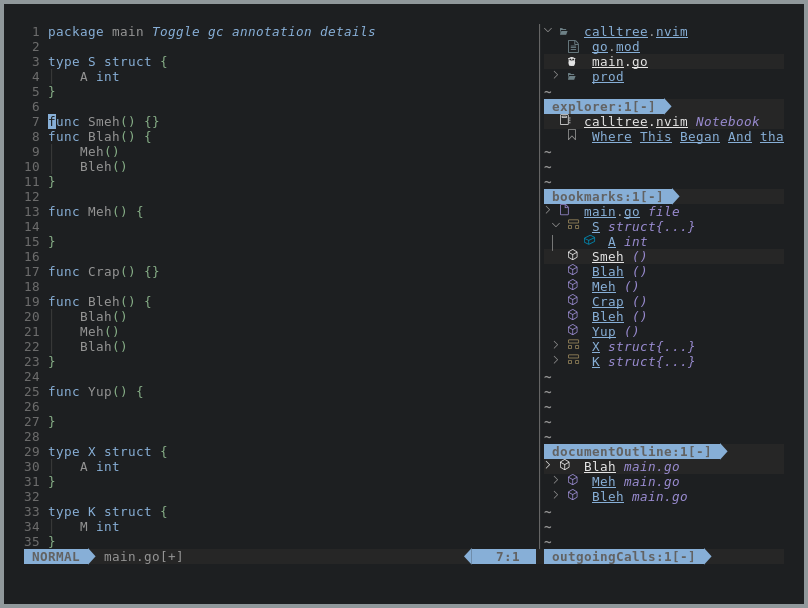
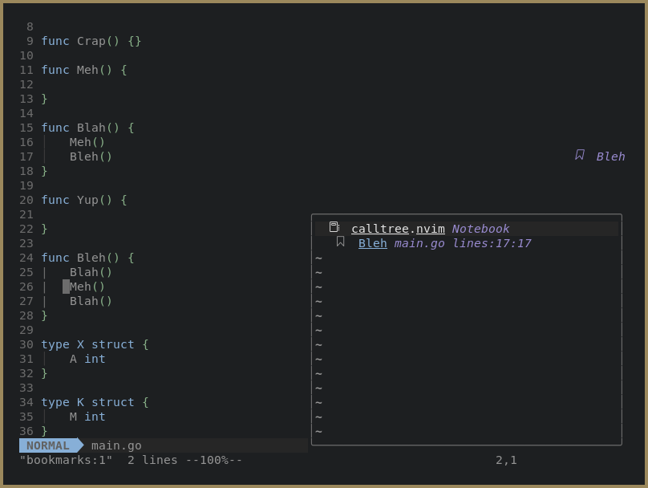

```
██╗     ██╗████████╗███████╗███████╗   ███╗   ██╗██╗   ██╗██╗███╗   ███╗
██║     ██║╚══██╔══╝██╔════╝██╔════╝   ████╗  ██║██║   ██║██║████╗ ████║ Lightweight
██║     ██║   ██║   █████╗  █████╗     ██╔██╗ ██║██║   ██║██║██╔████╔██║ Integrated
██║     ██║   ██║   ██╔══╝  ██╔══╝     ██║╚██╗██║╚██╗ ██╔╝██║██║╚██╔╝██║ Text
███████╗██║   ██║   ███████╗███████╗██╗██║ ╚████║ ╚████╔╝ ██║██║ ╚═╝ ██║ Editing
╚══════╝╚═╝   ╚═╝   ╚══════╝╚══════╝╚═╝╚═╝  ╚═══╝  ╚═══╝  ╚═╝╚═╝     ╚═╝ Environment
====================================================================================
```



# litee-bookmarks

litee-bookmarks utilizes the [litee.nvim](https://github.com/ldelossa/litee.nvim) library to 
implement plugin for creating and saving bookmarks for a project.

In `litee-bookmarks` `Bookmarks` are organized into `Notebooks`. 

`Notebooks' can be created with the "LTCreateNotebook" command. 

Without any arguments this creates a `Notebook` associated with Neovim's 
current working directory, which is typically your project's root if you're
using an LSP.

You can then open the notebook with the "LTOpenNotebook" command. 

Without any arguments this opens the notebook associated with your project's 
root.

Once a `Notebook` has been opened you can begin creating `Bookmarks` with the 
`LTCreateBookmark` command. 

You can remove a `Bookmark` by placing your cursor over it and issuing the 
`LTDeleteBookmark` command.

`litee-bookmarks` also supports "arbitrary" `Notebooks`, ones which are associated
with no projects at all.

To create an "arbitrary" `Notebook` pass a notebook name to "LTCreateNotebook". 

You can then use the `LTListNotebooks` to get a `vim.ui.select` promp which lists 
all created `Notebooks` and will open one on selection.

Bookmarks are displayed via virtual text in the buffer and will function with the same properties as Neovim marks.



Like all `litee.nvim` backed plugins the UI will work with other `litee.nvim` plugins, 
keeping its appropriate place in a collapsible panel.

# Usage

## Get it

Plug:
```
 Plug 'ldelossa/litee.nvim'
 Plug 'ldelossa/litee-bookmarks.nvim'
```

## Set it

Call the setup function from anywhere you configure your plugins from.

Configuration dictionary is explained in ./doc/litee-bookmarks.txt (:h litee-bookmarks-config)

```
-- configure the litee.nvim library 
require('litee.lib').setup({})
-- configure litee-bookmarks.nvim
require('litee.bookmarks').setup({})
```
